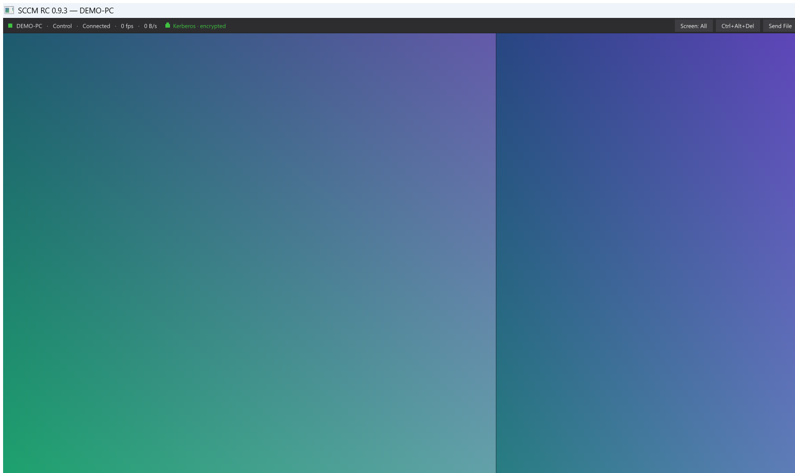
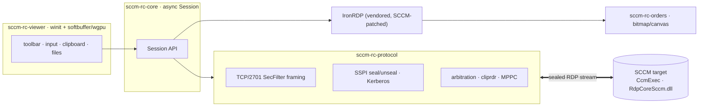

<h1 align="center">sccm-rc</h1>

<p align="center">
  <strong>A modern, pure-Rust viewer for SCCM ConfigMgr Remote Control.</strong><br>
  Encrypted &amp; Kerberos-authenticated, with clipboard, file transfer, multi-monitor and GPU rendering —
  a drop-in alternative to Microsoft's <code>CmRcViewer.exe</code>.
</p>

<p align="center">
  <a href="https://github.com/conocidotech/sccm-rc-viewer/actions/workflows/ci.yml"></a>
  
  
  
  <a href="https://github.com/conocidotech/sccm-rc-viewer/releases/latest"></a>
</p>

<p align="center">
  <a href="https://github.com/conocidotech/sccm-rc-viewer/releases/latest"></a>
</p>

<p align="center">
  
</p>

---

`sccm-rc` re-implements the **operator-side viewer** of Microsoft's ConfigMgr
Remote Control (the ConfigMgr 2012-era ActiveX-hosting Win32 binary
`CmRcViewer.exe`). Targets keep running the existing SCCM client agent
(`CcmExec` / `RdpCoreSccm.dll`) unchanged — only the viewer is reimplemented.

It speaks the SCCM RC wire protocol directly: an SSPI-sealed (Kerberos/NTLM)
TCP/2701 stream carrying a standard RDP byte stream, decoded with a vendored,
SCCM-patched [IronRDP](https://github.com/Devolutions/IronRDP).

## Features

**🔒 Security**
- Every frame is **SSPI-sealed**; the client refuses unencrypted channels (fail-closed).
- **Kerberos mutual authentication** with a live security indicator (verifies the
  server holds the target's service key — the SSPI equivalent of a valid certificate).

**🖥️ Productivity**
- Bidirectional **clipboard** (MS-RDPECLIP `cliprdr`) and **file transfer**.
- **Multi-monitor**: view *all screens* of a multi-monitor target as one combined
  desktop (SCCM "All Screens", `--all-screens`), then switch to an individual screen
  on the fly from the toolbar or with **Ctrl+Tab** — instantly, no reconnect.
- Full keyboard/mouse control incl. Win-key passthrough, or **view-only**.

**🛠️ Operations**
- **Audit log** + optional **session recording**.
- **Curtain / privacy mode** and remote-input lock.
- **Wake-on-LAN**, dead-connection detection and automatic reconnect / host-switch.
- Pre-flight **prerequisite checker** that explains *which* requirement is missing.

**🎨 Rendering**
- Native window (`winit`) with a **software** (`softbuffer`) or **GPU** (`wgpu`)
  renderer, dirty-region uploads, and a crisp client-rendered cursor.

## Why this exists

| | Original `CmRcViewer.exe` | `sccm-rc` |
|---|---|---|
| HiDPI / multi-monitor | poor | ✅ |
| Error messages | cryptic, hide the real prerequisite | ✅ clear pre-flight diagnostics |
| Clipboard / file transfer | ❌ | ✅ |
| Audit / session recording | ❌ | ✅ |
| Bulk / host-switch workflow | ❌ | ✅ |
| Rendering | ActiveX host | ✅ native software/GPU |
| Footprint | legacy Win32 + ActiveX | ✅ single self-contained binary |

## Architecture



| Crate | Purpose |
|---|---|
| `sccm-rc-protocol` | TCP/2701 SecFilter framing, SSPI seal/unseal handshake, session arbitration, `cliprdr` clipboard, MPPC decompression |
| `sccm-rc-orders` | RDP drawing-order + bitmap decode and software canvas |
| `sccm-rc-core` | High-level async `Session` API; glues the protocol layer to IronRDP |
| `sccm-rc-diag` | Pre-flight prerequisite checker (TCP/2701, LSA/SCM/WMI); CLI + library |
| `sccm-rc-viewer` | Native viewer UI (rendering, toolbar, clipboard, file transfer, curtain, audit, recording) |

The on-wire format is documented in [`docs/SPEC.md`](docs/SPEC.md) and
[`docs/PROTOCOL.md`](docs/PROTOCOL.md), as observed from a live `CmRcViewer.exe`
session. `experiments/` holds the reverse-engineering tooling used to derive it.

## Quick start

**Just want to run it?** Download the prebuilt Windows binary from the
[latest release](https://github.com/conocidotech/sccm-rc-viewer/releases/latest),
extract, and run `sccm-rc-viewer.exe <host>`. To build from source:

Targets the `x86_64-pc-windows-gnu` toolchain (no admin / MSVC Build Tools needed).
The MinGW-w64 linker/`dlltool` comes from [WinLibs](https://winlibs.com/).

```powershell
# One-time setup
rustup toolchain install stable-x86_64-pc-windows-gnu --profile minimal
winget install --id BrechtSanders.WinLibs.POSIX.UCRT --scope user

# Build
. .\env.ps1                 # prepends rust + MinGW to $env:Path
cargo build --release
```

```powershell
# Connect the viewer to a target (prompts for a host if omitted)
cargo run --release -p sccm-rc-viewer -- TARGET-HOST

# All Screens (combined multi-monitor desktop; switch screens with Ctrl+Tab),
# plus Wake-on-LAN
cargo run --release -p sccm-rc-viewer -- TARGET-HOST --all-screens --wake --mac AA-BB-CC-DD-EE-FF

# Pre-flight prerequisite check (exit 0 = clear, 2 = blocker found)
cargo run -p sccm-rc-diag -- TARGET-HOST --json
```

CI (`.github/workflows/ci.yml`) builds and tests the workspace on `windows-latest`
with the same gnu toolchain.

## Vendored IronRDP

`vendor/ironrdp-connector` is a patched copy of the crate (see
[`vendor/ironrdp-connector/SCCM-PATCHES.md`](vendor/ironrdp-connector/SCCM-PATCHES.md))
redirected via `[patch.crates-io]`. The patch allows standard RDP security
(`encryption = NONE`) because the SCCM SecurityFilter already seals every frame.
Its upstream MIT/Apache-2.0 licenses are preserved in that directory.

## Status & roadmap

Working and in active use; see [`docs/ROADMAP.md`](docs/ROADMAP.md) for what's done
and planned.

## Contributing

Contributions are welcome — see [`CONTRIBUTING.md`](CONTRIBUTING.md) for the build
setup, tests and style. Please be mindful of the [Code of Conduct](CODE_OF_CONDUCT.md).

## Security

This is a security-sensitive tool. Please report vulnerabilities privately via
the process in [`SECURITY.md`](SECURITY.md) rather than a public issue.

## License

Dual-licensed under either of [Apache-2.0](LICENSE-APACHE) or [MIT](LICENSE-MIT) at
your option. The vendored IronRDP code retains its own MIT/Apache-2.0 licenses.
